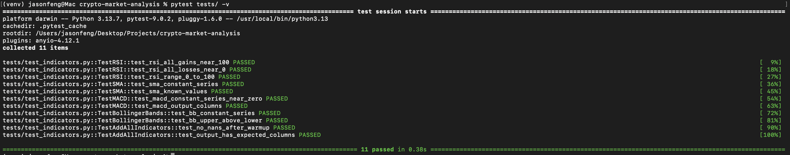

# Crypto Market Analysis

> **[Live Demo](https://crypto-market-analysis-rho.vercel.app)** — CryptoScope React frontend with live CoinGecko data

**Can freely available market data + standard ML techniques produce meaningful next-day signals for BTC, ETH, and SOL?**

A Python data pipeline + interactive dashboards built to find out.



---

## ML Model Comparison

BTC next-day price prediction (80/20 chronological split, 333 samples, 43 features):

**BTC (单次 80/20 split):**

| Model | RMSE | MAE | R² | MAPE |
|-------|------|-----|-----|------|
| ▶ Naive Baseline | $2,435.08 | $1,672.67 | 0.9324 | 2.31% |
| Ridge Regression | $2,910.40 | $2,052.46 | 0.9034 | 2.82% |
| Linear Regression | $4,547.32 | $3,510.76 | 0.7641 | 4.88% |
| Random Forest | $18,431.28 | $16,337.74 | -2.8748 | 23.55% |
| Gradient Boosting | $18,289.89 | $16,469.50 | -2.8156 | 23.61% |

> The naive baseline outperformed all four ML models on BTC. The pattern held across ETH and SOL as well — tree-based models (Random Forest, Gradient Boosting) performed especially poorly with negative R² values, meaning they were worse than simply predicting the mean. Only Ridge Regression came close to the baseline, suggesting the signal in technical indicators is weak for next-day price prediction.

## What I Learned

The most valuable outcome wasn't "a great predictor" — it was discovering how easy it is for time-series models to look good until you compare them against a naive baseline ("tomorrow = today"). On some coins, the baseline was hard to beat. That single comparison changed how I think about ML evaluation.

## Architecture

```
crypto-market-analysis/
├── src/                          # Python pipeline
│   ├── fetch_data.py             # Phase 1: CoinGecko API data ingestion
│   ├── clean_data.py             # Phase 2: Cleaning & preprocessing
│   ├── indicators.py             # Phase 3: RSI, MACD, Bollinger Bands, SMA/EMA
│   ├── visualize.py              # Phase 4: Chart generation (matplotlib)
│   ├── correlation.py            # Phase 5: Cross-asset correlation analysis
│   └── ml_model.py               # Phase 6: ML forecasting + naive baseline + walk-forward CV
├── app/
│   ├── dashboard.py              # Phase 7: Streamlit dashboard (dark theme, i18n)
│   └── frontend/                 # React/Vite "CryptoScope" UI prototype
│       ├── src/pages/            #   Markets, Technical, Insights, Watchlist, Data
│       ├── src/components/       #   MetricCard, AIInsightCard, PredictionCard, etc.
│       ├── src/utils/            #   signals.js, sentiment.js, predictions.js (heuristic)
│       └── src/i18n/             #   EN / 中文 / ES locale files
├── tests/                        # pytest unit tests for indicators & features
├── docs/                         # Methodology documentation
├── data/                         # Generated data (not committed)
└── images/                       # Generated charts (not committed)
```

## Key Features

**Python Pipeline:**
- 7-phase workflow: fetch → clean → indicators → visualize → correlation → ML → dashboard
- CoinGecko API with rate-limit-aware pacing
- 4 ML models + naive baseline, evaluated with RMSE/MAE/R²/MAPE
- Walk-forward cross-validation via `TimeSeriesSplit` (`--cv` flag)

**CryptoScope React Frontend:**
- Exchange-inspired dark UI (OKX/Binance style)
- Sentiment gauge, rule-based signals, 24h forecast (explicitly heuristic, not real ML)
- Watchlist + mock portfolio with localStorage persistence
- i18n: English, 中文, Español

**Streamlit Dashboard:**
- Interactive Plotly charts with OKX-style dark theme
- Markets / Technical / Correlation / Data explorer tabs
- Multi-language support (EN / 中文 / ES)

## Quick Start

```bash
# Clone & setup
git clone https://github.com/fengjason332-alt/crypto-market-analysis.git
cd crypto-market-analysis
python3 -m venv venv && source venv/bin/activate
pip install -r requirements.txt

# Run the pipeline
python src/fetch_data.py          # Fetch 365 days of BTC/ETH/SOL data
python src/clean_data.py          # Clean & merge
python src/indicators.py          # Compute technical indicators
python src/visualize.py           # Generate charts
python src/correlation.py         # Cross-asset correlation
python src/ml_model.py            # ML prediction (default: 80/20 split)
python src/ml_model.py --cv       # ML prediction (walk-forward CV)

# Launch dashboards
streamlit run app/dashboard.py    # Streamlit dashboard

# React frontend (separate terminal)
cd app/frontend && npm install && npm run dev
```

## Run Tests

```bash
pytest tests/ -v
```

## Tech Stack

| Layer | Tools |
|-------|-------|
| Data | pandas, numpy, CoinGecko API, ccxt |
| ML | scikit-learn (Linear, Ridge, Random Forest, Gradient Boosting) |
| Visualization | matplotlib, seaborn, plotly |
| Dashboard | Streamlit |
| Frontend | React 18, Vite, Recharts, Tailwind CSS |
| Testing | pytest |

## Methodology

See [docs/METHODOLOGY.md](docs/METHODOLOGY.md) for details on target definition, baseline selection, evaluation strategy, and which "AI" modules in the React app are heuristic vs real ML.

## Author

Jason Feng — University of Utah, Game Design & CS
